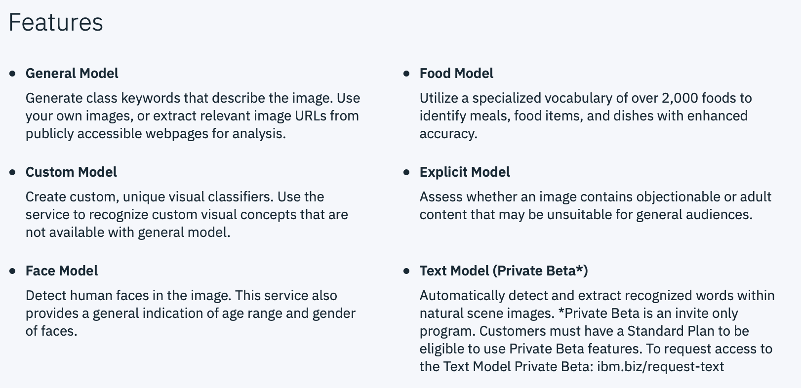
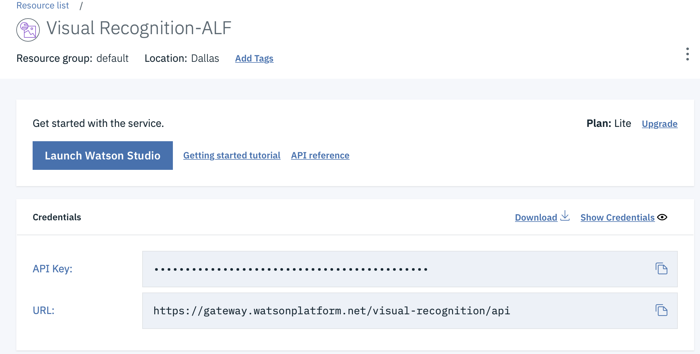
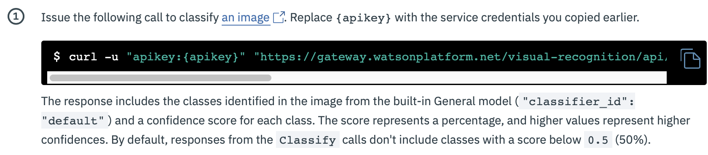

# 2019-06-29-30-School-42

# URL: [https://bit.ly/2RsMqpk](https://bit.ly/2RsMqpk)

# Call for Code signup link: [https://ibm.biz/Bdz4SD](https://ibm.biz/Bdz4SD)

[Whitelisting:](https://cloud.ibm.com/registration/whitelist)

## Introduction

[Call for code challenge 2019](https://callforcode.org/challenge/)

Natural disasters can’t be prevented but we can be better prepared. In this workshop you will learn about solutions to help with natural disasters preparedness/recovery. You will learn about: 

1. custom image classifier with Watson Visual Recognition 

1. deploying the custom visual model on IBM Cloud and then use in your applications 

1. integrating other Watson cognitive services in your applications.

## [Watson Visual Recognition demo](https://www.ibm.com/watson/services/visual-recognition/demo/)

## [https://cloud.ibm.com/developer/watson/starter-kits](https://cloud.ibm.com/developer/watson/starter-kits)

### Models

[Creating Visual Recognition custom models](https://dataplatform.cloud.ibm.com/docs/content/wsj/analyze-data/visual-recognition-create-model.html)

[Overview: Visual Recognition in Watson Studio](https://dataplatform.cloud.ibm.com/docs/content/wsj/analyze-data/visual-recognition-sample-training-images.html?audience=wdp&linkInPage=true)

## Step by Step Introduction to Visual Recognition in the IBM Cloud

1. [IBM Cloud Catalog](https://cloud.ibm.com/catalog)
1. [IBM AI resources in the IBM Cloud](https://cloud.ibm.com/catalog?category=ai)
1. [Watson Visual Recognition in the IBM Cloud. ](https://cloud.ibm.com/catalog/services/visual-recognition). 
   Click on "Create" in bottom right corner to create an instance of the Watson Visual Recognition in the IBM Cloud
1. [Your resources in the IBM Cloud, including Watson Visual Recognition](https://cloud.ibm.com/resources)
   Click on your "Visual Recognition Service"
1. Click on "Manage" in the upper left hand corner
1. Click on the "Show Credentials" to the right in the picture below to make it visible and then click on "save API key" 
   for later use
   
   

1. [Click on Visual Recognition Service](https://cloud.ibm.com/apidocs/visual-recognition?code=try)

[This tutorial guides you through how to use some built-in models in IBM Watson Visual Recognition to classify an image and then detect faces in an image.](https://cloud.ibm.com/docs/services/visual-recognition?topic=visual-recognition-getting-started-tutorial)

# Classify an image

curl -u "apikey:{apikey}" "https://gateway.watsonplatform.net/visual-recognition/api/v3/classify?url=https://watson-developer-cloud.github.io/doc-tutorial-downloads/visual-recognition/640px-IBM_VGA_90X8941_on_PS55.jpg&version=2018-03-19"

1. curl -u apikey:XXXXXXXX
1. https://cloud.ibm.com/docs/services/visual-recognition?topic=visual-recognition-getting-started-tutorial#classify 

To classify an image we need the following data:

1. Our API key: covered as:XXXXXXXX
1. The Watson Visual Recognition API: https://gateway.watsonplatform.net/visual-recognition/api/v3/classify
1. The image which is stored in github "watson-developer-cloud.github.io/doc-tutorial-downloads/visual-recognition/640px-IBM_VGA_90X8941_on_PS55.jpg&version=2018-03-19"

[Click on Visual Recognition API Docs](https://cloud.ibm.com/apidocs/visual-recognition)
1. [Try it out](https://cloud.ibm.com/apidocs/visual-recognition?code=try)
1. [Click on Visual Recognition](https://cloud.ibm.com/services/watson-vision-combined/)

[Classify an image](https://cloud.ibm.com/docs/services/visual-recognition?topic=visual-recognition-getting-started-tutorial#classify)

curl -u apikey:XXXXXXXX  "https://gateway.watsonplatform.net/visual-recognition/api/v3/classify?url=https://watson-developer-cloud.github.io/doc-tutorial-downloads/visual-recognition/640px-IBM_VGA_90X8941_on_PS55.jpg&version=2018-03-19"

## output:

<code>

{
    "images": [
        {
            "classifiers": [
                {
                    "classifier_id": "default",
                    "name": "default",
                    "classes": [
                        {
                            "class": "circuit board",
                            "score": 0.578,
                            "type_hierarchy": "/electrical device/computer circuit/circuit board"
                        },
                        {
                            "class": "computer circuit",
                            "score": 0.755
                        },
                        {
                            "class": "electrical device",
                            "score": 0.757
                        },
                        {
                            "class": "disk controller",
                            "score": 0.553,
                            "type_hierarchy": "/controller/disk controller"
                        },
                        {
                            "class": "controller",
                            "score": 0.558
                        },
                        {
                            "class": "central processing unit",
                            "score": 0.535
                        },
                        {
                            "class": "PC board",
                            "score": 0.501,
                            "type_hierarchy": "/electrical device/computer circuit/PC board"
                        },
                        {
                            "class": "CPU board",
                            "score": 0.5,
                            "type_hierarchy": "/electrical device/computer circuit/CPU board"
                        },
                        {
                            "class": "electronic equipment",
                            "score": 0.6
                        },
                        {
                            "class": "memory device",
                            "score": 0.599
                        },
                        {
                            "class": "microchip",
                            "score": 0.592
                        },
                        {
                            "class": "jade green color",
                            "score": 0.838
                        },
                        {
                            "class": "emerald color",
                            "score": 0.787
                        }
                    ]
                }
            ],
            "source_url": "https://watson-developer-cloud.github.io/doc-tutorial-downloads/visual-recognition/640px-IBM_VGA_90X8941_on_PS55.jpg",
            "resolved_url": "https://watson-developer-cloud.github.io/doc-tutorial-downloads/visual-recognition/640px-IBM_VGA_90X8941_on_PS55.jpg"
        }
    ],
    "images_processed": 1,
    "custom_classes": 0
}

</code>

# Create a Custom image classifier with Watson Visual Recognition 

  https://youtu.be/vnWblT50w1Y
  
  [Create Watson Studio service](https://cloud.ibm.com/catalog/services/watson-studio)

# Deploying the custom visual model on IBM Cloud and then use in your applications 
# Integrating other Watson cognitive services in your applications

# [Watson Starter Kits](https://cloud.ibm.com/developer/watson/starter-kits)

### IBM Code Patterns

1. [A beginner’s guide to setting up a visual recognition service](https://developer.ibm.com/articles/a-beginners-guide-to-set-up-a-visual-recognition-service/)
1. [Identify Cities from Space](https://developer.ibm.com/patterns/identify-cities-from-space-using-watson-visual-recognition/)
1. [Classify Vehicle Damage Images](https://developer.ibm.com/patterns/classify-vehicle-damage-images/)
1. [Optimize your visual recognition classification](https://developer.ibm.com/patterns/optimize-visual-recognition-classification/)
1. [Create a real-time object detection app using Watson Machine Learning](https://developer.ibm.com/patterns/create-a-real-time-object-detection-app-using-watson-machine-learning/)

