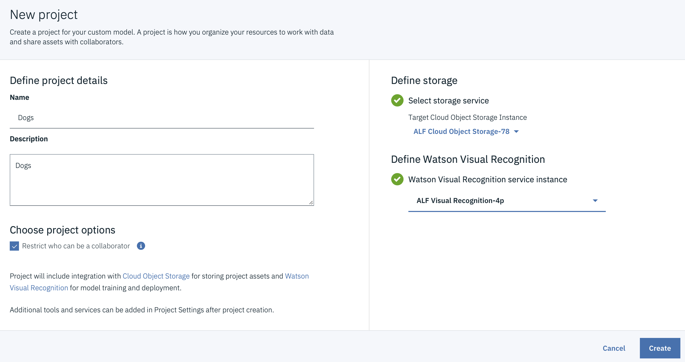

# URL: [https://bit.ly/2RsMqpk](https://bit.ly/2RsMqpk)

# Visual Recognition and Watson Services

# 1) Introduction

Natural disasters can’t be prevented but we can be better prepared. In this workshop you will learn about solutions to help with natural disasters preparedness/recovery. 

###  Sign up for Call for Code: [https://ibm.biz/Bdz4SD](https://ibm.biz/Bdz4SD)

### [IBM Cloud](https://cloud.ibm.com/catalog)

### [Watson AI services](https://cloud.ibm.com/catalog?category=ai)

### [Watson Visual Recognition demo](https://www.ibm.com/watson/services/visual-recognition/demo/)

### Visual Recognition Models

## 2) Step by Step Introduction to Visual Recognition in the IBM Cloud

1. [Select "Watson Visual Recognition service" in the IBM Cloud Catalog](https://cloud.ibm.com/catalog/services/visual-recognition). 
   Click on "Create" in bottom right corner to create an instance of the Watson Visual Recognition in the IBM Cloud
1. Click on the hamburger menu at the uppler left hand corner in the window and select
[Resource List](https://cloud.ibm.com/resources)

1. Click on your "Visual Recognition Service" in the Services Section. This is the Visual Recognition Service you just created.
1. Click on "Manage" in the upper left hand corner
1. Click on the "Show Credentials" to the right in the picture below to make it visible and then click on the "copy API 
   key icon: for later use. To invoke the Visual Recognition service we will need the API key.
   
   

1. [Click "API Reference", shown in the picture above](https://cloud.ibm.com/apidocs/visual-recognition) for a description on how to invoke the Visual Recognition Service from Curl, Go, Java, Node, Python, Ruby, and Swift.

1. [Click on "Visual Recognition Service"](https://cloud.ibm.com/apidocs/visual-recognition?code=try) for a number of  
    examples of how to invoke the Visual Recognition Service with Curl, Go, Java, Node, Python Ruby and Swift.

1. [This getting started tutorial](https://cloud.ibm.com/docs/services/visual-recognition?topic=visual-recognition-getting-started-tutorial) guides you through how to use some built-in models in IBM Watson Visual Recognition to classify an image and then detect faces in an image.

1. [Working with the Visual Recognition API](https://cloud.ibm.com/apidocs/visual-recognition?code=try) brings us to the screen below  

1. [Visual Recognition Getting Started Tutorial ](https://cloud.ibm.com/docs/services/visual-recognition?topic=visual-recognition-getting-started-tutorial#getting-started-tutorial)

## 3) Create Visual Recognition Custom Model

1. From the IBM Cloud Catalog, create an instance of [Cloud Object Storage](https://cloud.ibm.com/catalog/services/cloud-object-storage) That is where we will store the images we will analyze.
√
1. Click on the hamburger menu in the upper left hand corner the IBM Cloud window

1. Click on the Resource List

1. Click on your Visual Recognition Service in the Resource List
 
1. In the Visual Recognition service window, click on the blue Launch Watson Studio button. (The same window we see higher up in this tutorial

1. Then click on "Classify Images" and "Create Model" as shown in the picture below.

1. Fill in data and click "Create" in the lower right-hand corner.

1. [Create Visual Recognition Custom Models](https://dataplatform.cloud.ibm.com/docs/content/wsj/analyze-data/visual-recognition-create-model.html) 

1. [Overview: Visual Recognition in Watson Studio](https://dataplatform.cloud.ibm.com/docs/content/wsj/analyze-data/visual-recognition-sample-training-images.html?audience=wdp&linkInPage=true)

1. [Create Watson Studio service](https://cloud.ibm.com/catalog/services/watson-studio) 

Data to analyze

1. https://watson-developer-cloud.github.io/doc-tutorial-downloads/visual-recognition/beagle.zip
1. https://watson-developer-cloud.github.io/doc-tutorial-downloads/visual-recognition/golden-retriever.zip
1. https://watson-developer-cloud.github.io/doc-tutorial-downloads/visual-recognition/husky.zip
1. https://watson-developer-cloud.github.io/doc-tutorial-downloads/visual-recognition/cats.zip

## 4)  Deploying the custom visual model on IBM Cloud and then use in your applications 

[YouTube: IBM Watson Studio: Get Started With Visual Recognition](https://www.youtube.com/watch?v=o8xxZcmuc2Q)

[Kaggle free datasets](https://www.kaggle.com/datasets)

# Integrating other Watson cognitive services in your applications

1. [Watson Assistant](https://cloud.ibm.com/catalog/services/watson-assistant)
1. [All AI services in the IBM Cloud](https://cloud.ibm.com/catalog?category=ai)
1. [Speech to Text](https://www.ibm.com/watson/services/speech-to-text/)

# [Watson Starter Kits](https://cloud.ibm.com/developer/watson/starter-kits)

### IBM Code Patterns. 

1. [A beginner’s guide to setting up a visual recognition service](https://developer.ibm.com/articles/a-beginners-guide-to-set-up-a-visual-recognition-service/)
1. [Identify Cities from Space](https://developer.ibm.com/patterns/identify-cities-from-space-using-watson-visual-recognition/)
1. [Classify Vehicle Damage Images](https://developer.ibm.com/patterns/classify-vehicle-damage-images/)
1. [Optimize your visual recognition classification](https://developer.ibm.com/patterns/optimize-visual-recognition-classification/)
1. [Create a real-time object detection app using Watson Machine Learning](https://developer.ibm.com/patterns/create-a-real-time-object-detection-app-using-watson-machine-learning/)

# Appendix

1. custom image classifier with Watson Visual Recognition 

1. deploying the custom visual model on IBM Cloud and then use it in your applications 

1. integrating other Watson cognitive services in your applications.

[White listing:](https://cloud.ibm.com/registration/whitelist)
